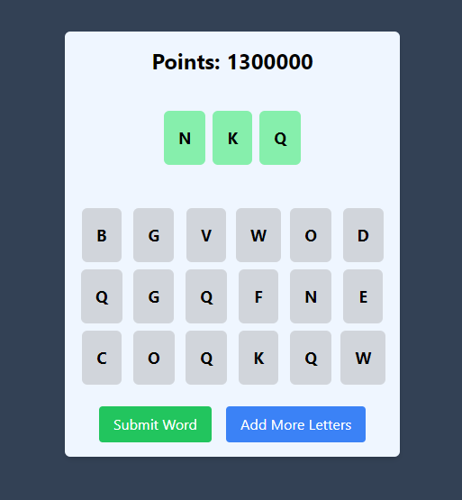

# Word Game Project

## Description

This is a word game project that allows users to select random letters and form valid words. Users can add more letters and check if the formed words are valid based on a predefined list of words. The project features a confetti animation for successful actions and a visually appealing layout.

## Features

- Random letter generation
- Validity check against a list of words
- Confetti animation on valid word submissions
- Responsive design
- Easy-to-use interface

## Screen Shot



## Technologies Used

- React
- JavaScript
- HTML & CSS
- [canvas-confetti](https://github.com/catdad/canvas-confetti) for confetti animation

## Getting Started

### Prerequisites

- Node.js and npm installed on your machine.

### Installation

1. Clone the repository:

   ```bash
   git clone https://github.com/yourusername/word-game.git
   ```

2. Navigate to the project directory:

   ```bash
   cd word-game
   ```

3. Install the required dependencies:

   ```bash
   npm install
   ```

4. Create a `english.txt` file in the `public` directory and populate it with valid words:
   ```
   // Example
   abstain
   abstemious
   abstention
   abstinence
   abstract etc.
   ```

### Usage

To start the development server, run:

```bash
npm run start
```

Open your browser and go to `http://localhost:3000` to view the application.

### Adding More Letters

The game allows you to add more letters until a maximum limit is reached. Click the "Add More Letters" button to generate additional letters.

### Valid Word Check

The game checks if the formed word is valid against the list in `english.txt`. A confetti animation will trigger if the word is valid.

## Acknowledgments

- Thanks to the [canvas-confetti](https://github.com/catdad/canvas-confetti) library for providing an easy way to add fun animations to our application.
- Inspiration from various word games that promote learning and engagement.
